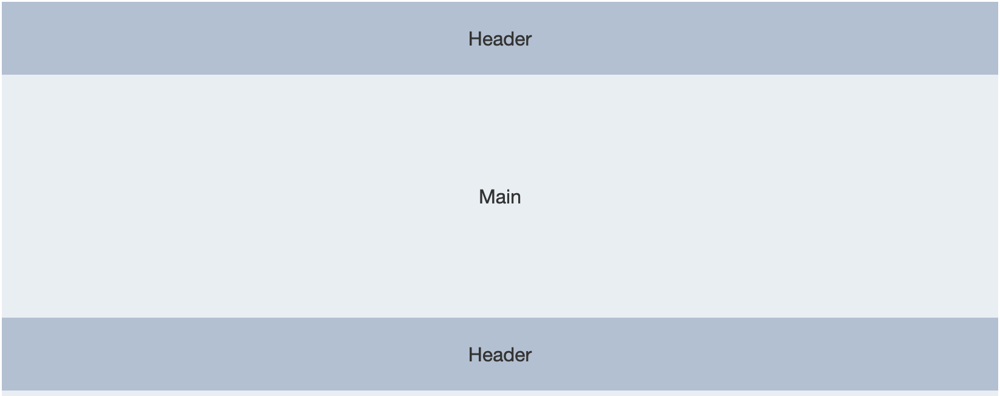

# Create Project

vue create mystore-20200820
// select vue router, babel, eslint

## Project setup
```
yarn install
```

### Compiles and hot-reloads for development
```
yarn serve
```


# 项目入口 main.js


## 引入 ElementUI

安装
```
yarn add element-ui-2.4.6
```

```js
import ElementUI from 'element-ui';
import 'element-ui/lib/theme-chalk/index.css';
Vue.use(ElementUI);
```

## 引入全局配置项

相关学习资料
/*
exports.install --> Vue 全局挂载自定义函数
https://www.cnblogs.com/cjh1996/p/12689631.html
https://cn.vuejs.org/v2/api/#Vue-use
https://cn.vuejs.org/v2/guide/plugins.html
*/

```js
// 全局函数及变量
import Global from './Global'
Vue.use(ElementUI)
Vue.use(Global)
```

## 引入 axios 调用后端API

安装
```
yarn add axios
```

```js
import Axios from 'axios';
Vue.prototype.$axios = Axios;
```

## 引入 vuex

```js
import store from './store'

new Vue({
  router,
 ->  store,
  render: h => h(App)
}).$mount('#app')
```

# copy /assets folder to this project

# App.vue 项目根组件

使用 ElementUI 的 el-container 组件



## 首先，晚上 el-header

因为 <!-- 顶部导航栏 --> <div class="topbar"> 已经和 vuex 发生联系，比较复杂。